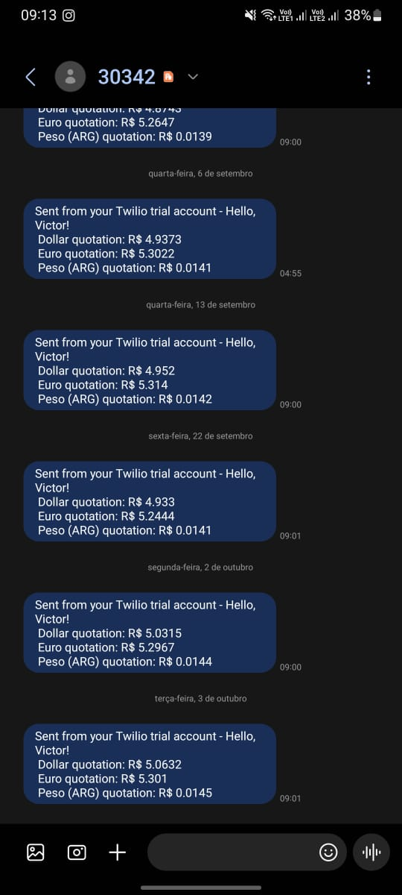

# Currency Quote

---

In this project an application was developed using Awesome and Twilio APIs. The objective was: collect Dolar, Euro and Argentinian Pesos currency in Brazilian Reais and then send the information via SMS to specified phone numbers.

The main objective was automate this task in order to make it easier to know when is the best moment to purchase a different currency during a trip preparation.
## Funcionalities

---

- API interconnection
- SMS service

The development was done using mainly:

- Python (back-end)

Main Pyhton libraries used:

- Twilio Client
- Requests

## Project Structure

---

```shell
currency-quote/
├── app.py
├── README.md
```


## Screenshots

---
API implementation result: SMS being sent automatically with the currency information.

